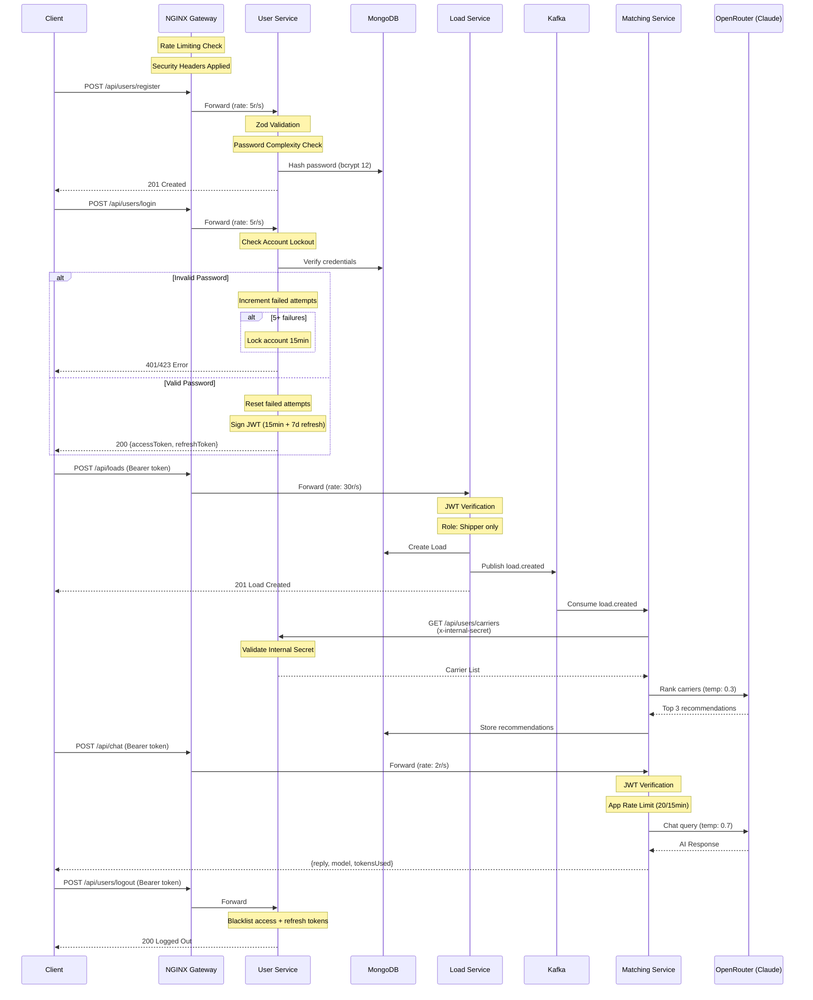
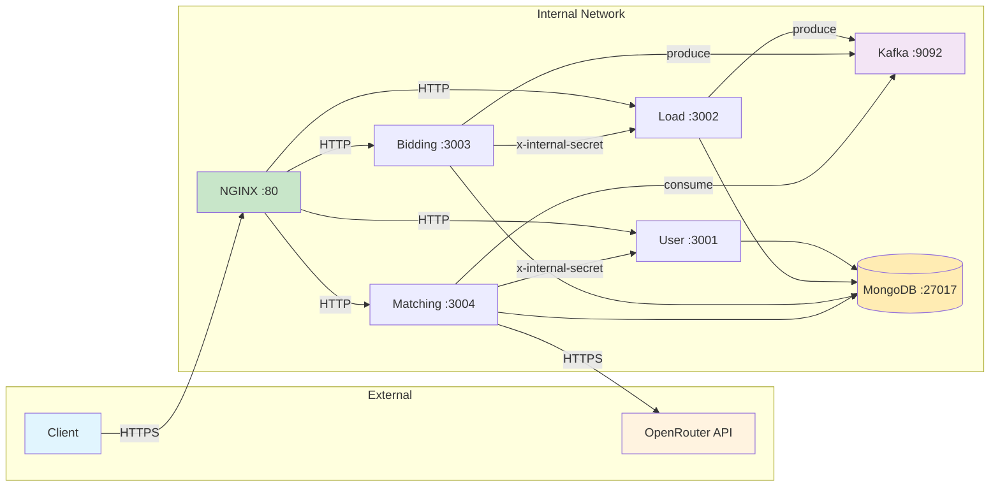

# FreightMatch System Architecture

## Updated Architecture Diagram

```mermaid
graph TB
    subgraph "Client Layer"
        CLIENT[Client Applications<br/>Web / Mobile / API]
    end

    subgraph "Security Gateway"
        NGINX[NGINX Reverse Proxy<br/>Port 80]
        NGINX_SEC[Security Headers<br/>HSTS, CSP, X-Frame-Options<br/>X-Content-Type-Options]
        NGINX_RL[Rate Limiting<br/>api_auth: 5r/s<br/>api_general: 30r/s<br/>api_chat: 2r/s]
        NGINX --- NGINX_SEC
        NGINX --- NGINX_RL
    end

    subgraph "Authentication Layer"
        JWT[JWT Authentication<br/>Access: 15min / Refresh: 7d]
        RBAC[Role-Based Access Control<br/>Shipper | Carrier]
        LOCKOUT[Account Lockout<br/>5 failures → 15min lock]
        BLACKLIST[Token Blacklist<br/>Logout Revocation]
        JWT --- RBAC
        JWT --- LOCKOUT
        JWT --- BLACKLIST
    end

    subgraph "Microservices"
        subgraph "User Service :3001"
            US[Express + Helmet + CORS]
            US_AUTH[Auth: Register / Login<br/>Logout / Refresh]
            US_PWD[Password Security<br/>bcrypt 12 rounds<br/>Complexity Rules]
            US_CARRIER[Carrier Profiles<br/>Internal Auth]
            US --- US_AUTH
            US --- US_PWD
            US --- US_CARRIER
        end

        subgraph "Load Service :3002"
            LS[Express + Helmet + CORS]
            LS_CRUD[Load CRUD<br/>Status Transitions]
            LS_RL[Rate Limiter<br/>100 req/15min]
            LS --- LS_CRUD
            LS --- LS_RL
        end

        subgraph "Bidding Service :3003"
            BS[Express + Helmet + CORS]
            BS_BIDS[Bid Management<br/>Submit / Accept]
            BS_RL[Rate Limiter<br/>100 req/15min<br/>Bids: 20/15min]
            BS --- BS_BIDS
            BS --- BS_RL
        end

        subgraph "Matching Service :3004"
            MS[Express + Helmet + CORS]
            MS_MATCH[AI Carrier Matching<br/>Auto-recommendations]
            MS_CHAT[AI Freight Chatbot<br/>Route / Pricing / Advice]
            MS_RL[Rate Limiter<br/>60 req/15min<br/>Chat: 20/15min]
            MS --- MS_MATCH
            MS --- MS_CHAT
            MS --- MS_RL
        end
    end

    subgraph "AI Layer"
        OPENROUTER[OpenRouter API<br/>LLM Provider]
        CLAUDE[Claude 3.5 Haiku<br/>Matching: temp 0.3<br/>Chat: temp 0.7]
        FALLBACK[Fallback Algorithm<br/>Rating-based ranking]
        OPENROUTER --- CLAUDE
        MS_MATCH --> OPENROUTER
        MS_CHAT --> OPENROUTER
        MS_MATCH -.->|API failure| FALLBACK
    end

    subgraph "Event Bus"
        KAFKA[Apache Kafka]
        TOPIC1[load.created]
        TOPIC2[bid.accepted]
        KAFKA --- TOPIC1
        KAFKA --- TOPIC2
    end

    subgraph "Data Layer"
        MONGO[(MongoDB 7<br/>Replica Set)]
        DB1[(freightmatch-users)]
        DB2[(freightmatch-loads)]
        DB3[(freightmatch-bidding)]
        DB4[(freightmatch-matching)]
        MONGO --- DB1
        MONGO --- DB2
        MONGO --- DB3
        MONGO --- DB4
    end

    subgraph "Observability"
        PROM[Prometheus<br/>Metrics Collection]
        GRAFANA[Grafana<br/>Dashboards]
        OTEL[OpenTelemetry<br/>Distributed Tracing]
        WINSTON[Winston + Loki<br/>Structured Logging]
        PROM --> GRAFANA
    end

    subgraph "Secrets Management"
        ENV[Environment Variables<br/>Zod Validated]
        SEC_JWT[JWT Secrets<br/>min 32 chars]
        SEC_INT[Internal Secret<br/>min 16 chars]
        SEC_API[API Keys<br/>OpenRouter]
        ENV --- SEC_JWT
        ENV --- SEC_INT
        ENV --- SEC_API
    end

    CLIENT --> NGINX
    NGINX --> US
    NGINX --> LS
    NGINX --> BS
    NGINX --> MS

    US --> DB1
    LS --> DB2
    BS --> DB3
    MS --> DB4

    LS -->|publish| TOPIC1
    BS -->|publish| TOPIC2
    MS -->|subscribe| TOPIC1

    MS -->|x-internal-secret| US_CARRIER

    US --> PROM
    LS --> PROM
    BS --> PROM
    MS --> PROM

    US --> OTEL
    LS --> OTEL
    BS --> OTEL
    MS --> OTEL
```

## Security Flow Diagram



## Service Communication Matrix


