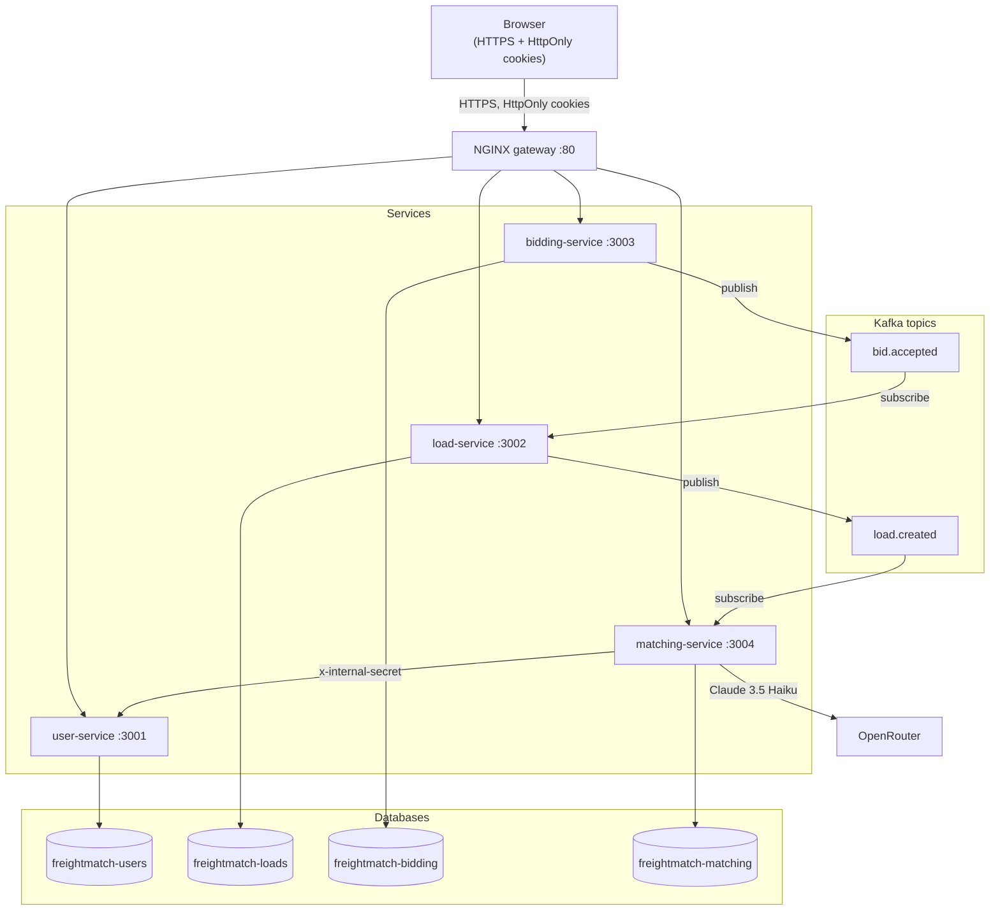
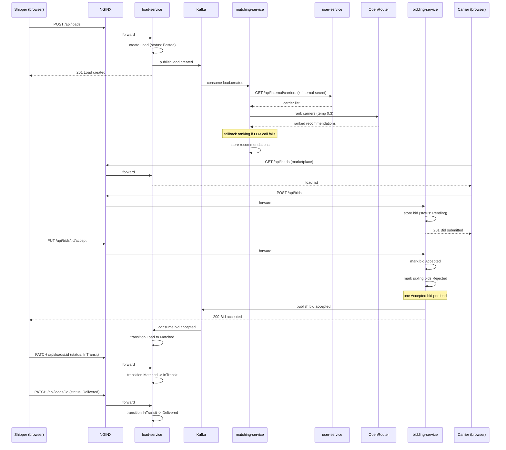
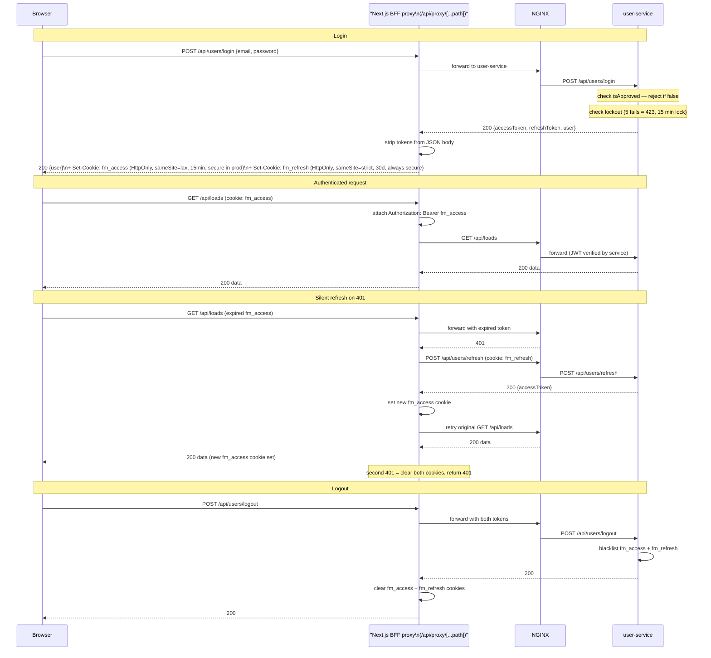
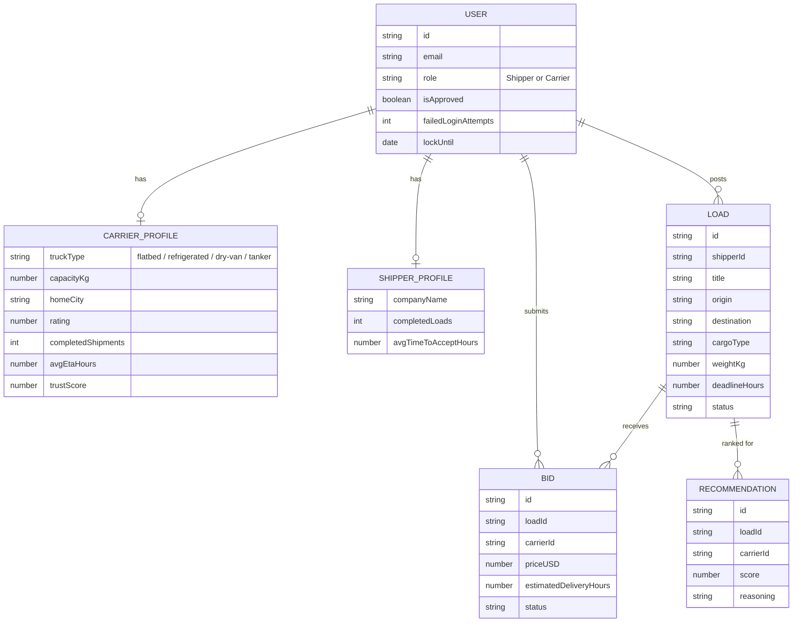
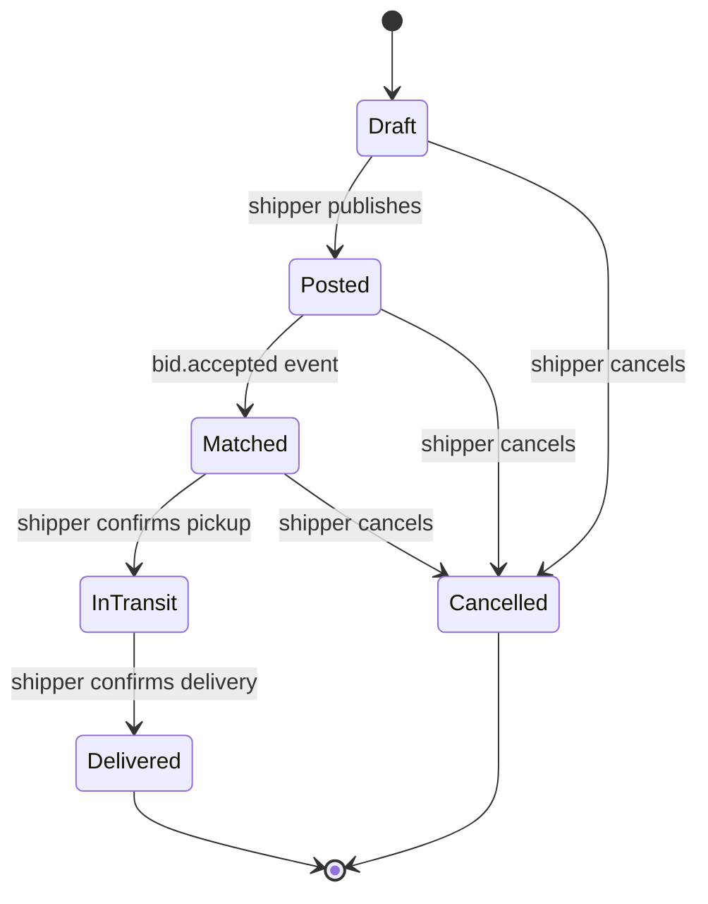
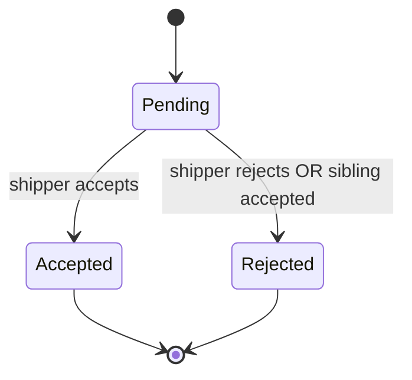

# FreightMatch — Architecture

A visual map of how the FreightMatch services fit together. Each diagram below answers one specific question. For the narrative version, see [PROJECT_REPORT.md](../PROJECT_REPORT.md).

## 1. System topology

All external traffic enters through NGINX on port 80; the four microservices, their MongoDB databases, the Kafka event bus, and OpenRouter are only reachable internally.

```mermaid
flowchart TB
    Browser["Browser\n(HTTPS + HttpOnly cookies)"]

    Browser -->|"HTTPS, HttpOnly cookies"| NGINX

    NGINX["NGINX gateway :80"]

    subgraph Services
        US["user-service :3001"]
        LS["load-service :3002"]
        BS["bidding-service :3003"]
        MS["matching-service :3004"]
    end

    NGINX --> US
    NGINX --> LS
    NGINX --> BS
    NGINX --> MS

    subgraph Databases
        DB1[("freightmatch-users")]
        DB2[("freightmatch-loads")]
        DB3[("freightmatch-bidding")]
        DB4[("freightmatch-matching")]
    end

    US --> DB1
    LS --> DB2
    BS --> DB3
    MS --> DB4

    subgraph KafkaTopics["Kafka topics"]
        T1["load.created"]
        T2["bid.accepted"]
    end

    LS -->|"publish"| T1
    T1 -->|"subscribe"| MS
    BS -->|"publish"| T2
    T2 -->|"subscribe"| LS

    MS -->|"x-internal-secret"| US
    MS -->|"Claude 3.5 Haiku"| OR["OpenRouter"]
```

## 2. Load lifecycle — end-to-end sequence

Traces a load from creation through carrier matching, bid acceptance, and final delivery.

```mermaid
sequenceDiagram
    participant Shipper as Shipper (browser)
    participant NGINX as NGINX
    participant LS as load-service
    participant Kafka as Kafka
    participant MS as matching-service
    participant US as user-service
    participant OR as OpenRouter
    participant BS as bidding-service
    participant Carrier as Carrier (browser)

    Shipper->>NGINX: POST /api/loads
    NGINX->>LS: forward
    LS->>LS: create Load (status: Posted)
    LS->>Kafka: publish load.created
    LS-->>Shipper: 201 Load created

    Kafka->>MS: consume load.created
    MS->>US: GET /api/internal/carriers (x-internal-secret)
    US-->>MS: carrier list
    MS->>OR: rank carriers (temp 0.3)
    OR-->>MS: ranked recommendations
    Note over MS: fallback ranking if LLM call fails
    MS->>MS: store recommendations

    Carrier->>NGINX: GET /api/loads (marketplace)
    NGINX->>LS: forward
    LS-->>Carrier: load list

    Carrier->>NGINX: POST /api/bids
    NGINX->>BS: forward
    BS->>BS: store bid (status: Pending)
    BS-->>Carrier: 201 Bid submitted

    Shipper->>NGINX: PUT /api/bids/:id/accept
    NGINX->>BS: forward
    BS->>BS: mark bid Accepted
    BS->>BS: mark sibling bids Rejected
    Note over BS: one Accepted bid per load
    BS->>Kafka: publish bid.accepted
    BS-->>Shipper: 200 Bid accepted

    Kafka->>LS: consume bid.accepted
    LS->>LS: transition Load to Matched

    Shipper->>NGINX: PATCH /api/loads/:id (status: InTransit)
    NGINX->>LS: forward
    LS->>LS: transition Matched -> InTransit

    Shipper->>NGINX: PATCH /api/loads/:id (status: Delivered)
    NGINX->>LS: forward
    LS->>LS: transition InTransit -> Delivered
```

## 3. Authentication & cookie flow

The Next.js BFF proxy intercepts every `/api/*` call, manages HttpOnly cookies, and handles silent token refresh so the browser never touches raw JWTs.

```mermaid
sequenceDiagram
    participant Browser as Browser
    participant BFF as "Next.js BFF proxy\n(/api/proxy/[...path])"
    participant NGINX as NGINX
    participant US as user-service

    Note over Browser,US: Login
    Browser->>BFF: POST /api/users/login {email, password}
    BFF->>NGINX: forward to user-service
    NGINX->>US: POST /api/users/login
    Note over US: check isApproved — reject if false
    Note over US: check lockout (5 fails = 423, 15 min lock)
    US-->>BFF: 200 {accessToken, refreshToken, user}
    BFF->>BFF: strip tokens from JSON body
    BFF-->>Browser: 200 {user}\n+ Set-Cookie: fm_access (HttpOnly, sameSite=lax, 15min, secure in prod)\n+ Set-Cookie: fm_refresh (HttpOnly, sameSite=strict, 30d, always secure)

    Note over Browser,US: Authenticated request
    Browser->>BFF: GET /api/loads (cookie: fm_access)
    BFF->>BFF: attach Authorization: Bearer fm_access
    BFF->>NGINX: GET /api/loads
    NGINX->>US: forward (JWT verified by service)
    US-->>BFF: 200 data
    BFF-->>Browser: 200 data

    Note over Browser,US: Silent refresh on 401
    Browser->>BFF: GET /api/loads (expired fm_access)
    BFF->>NGINX: forward with expired token
    NGINX-->>BFF: 401
    BFF->>NGINX: POST /api/users/refresh (cookie: fm_refresh)
    NGINX->>US: POST /api/users/refresh
    US-->>BFF: 200 {accessToken}
    BFF->>BFF: set new fm_access cookie
    BFF->>NGINX: retry original GET /api/loads
    NGINX-->>BFF: 200 data
    BFF-->>Browser: 200 data (new fm_access cookie set)

    Note over BFF: second 401 = clear both cookies, return 401

    Note over Browser,US: Logout
    Browser->>BFF: POST /api/users/logout
    BFF->>NGINX: forward with both tokens
    NGINX->>US: POST /api/users/logout
    US->>US: blacklist fm_access + fm_refresh
    US-->>BFF: 200
    BFF->>BFF: clear fm_access + fm_refresh cookies
    BFF-->>Browser: 200
```

## 4. Domain model & state machines

### Entity relationships

```mermaid
erDiagram
    USER {
        string id
        string email
        string role "Shipper or Carrier"
        boolean isApproved
        int failedLoginAttempts
        date lockUntil
    }
    CARRIER_PROFILE {
        string truckType "flatbed / refrigerated / dry-van / tanker"
        number capacityKg
        string homeCity
        number rating
        int completedShipments
        number avgEtaHours
        number trustScore
    }
    SHIPPER_PROFILE {
        string companyName
        int completedLoads
        number avgTimeToAcceptHours
    }
    LOAD {
        string id
        string shipperId
        string title
        string origin
        string destination
        string cargoType
        number weightKg
        number deadlineHours
        string status
    }
    BID {
        string id
        string loadId
        string carrierId
        number priceUSD
        number estimatedDeliveryHours
        string status
    }
    RECOMMENDATION {
        string id
        string loadId
        string carrierId
        number score
        string reasoning
    }

    USER ||--o| CARRIER_PROFILE : "has"
    USER ||--o| SHIPPER_PROFILE : "has"
    USER ||--o{ LOAD : "posts"
    USER ||--o{ BID : "submits"
    LOAD ||--o{ BID : "receives"
    LOAD ||--o{ RECOMMENDATION : "ranked for"
```

### Load state machine

```mermaid
stateDiagram-v2
    [*] --> Draft
    Draft --> Posted : shipper publishes
    Draft --> Cancelled : shipper cancels
    Posted --> Matched : bid.accepted event
    Posted --> Cancelled : shipper cancels
    Matched --> InTransit : shipper confirms pickup
    Matched --> Cancelled : shipper cancels
    InTransit --> Delivered : shipper confirms delivery
    Delivered --> [*]
    Cancelled --> [*]
```

### Bid state machine

```mermaid
stateDiagram-v2
    [*] --> Pending
    Pending --> Accepted : shipper accepts
    Pending --> Rejected : shipper rejects OR sibling accepted
    Accepted --> [*]
    Rejected --> [*]
```
